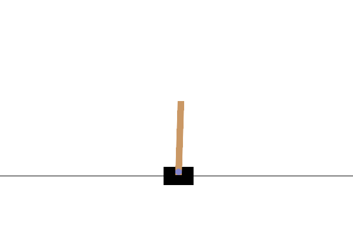

# CartPole N-step Q-learning 🏋️🤖

[](https://pytorch.org/)
[](https://gymnasium.farama.org/)
[](LICENSE)

PyTorch implementation of an **N-step Off-policy Q-learning agent** trained to solve **CartPole-v1** with [Gymnasium](https://gymnasium.farama.org/).  
The project features a **modular architecture**, configurable hyperparameters, reward logging, checkpointing, and rendering.

---

## Features
- 🧠 **N-step Off-policy Q-learning** with replay buffer  
- ⚙️ **Configurable architecture** (layers, activations, dropout) in `config.py`  
- 🎲 **Epsilon-greedy exploration** with flexible decay schedules  
- 📊 **Reward tracking** to CSV & TensorBoard  
- 💾 **Model checkpoint saving & loading**  
- 🎬 **Rendering** of trained agent  

---

## Installation
Clone the repository and install dependencies:

```bash
git clone https://github.com/yourusername/nstep-qlearning-cartpole.git
cd cart-pole
pip install -r requirements.txt
```

### GPU Acceleration (Optional)
By default, `requirements.txt` installs the **CPU version** of PyTorch for maximum portability.  
If you have a CUDA-enabled GPU, install a matching CUDA build of PyTorch from the [official wheels](https://pytorch.org/get-started/previous-versions/).

### CUDA 11.8 example:
```bash
pip install torch==2.0.1+cu118 torchvision==0.15.2+cu118 torchaudio==2.0.2+cu118 \
  --index-url https://download.pytorch.org/whl/cu118
```

### CUDA 12.1 example (latest builds):
```bash
pip install torch==2.4.1 torchvision==0.19.1 torchaudio==2.4.1 \
  --index-url https://download.pytorch.org/whl/cu121
```

---

## 🏋️ Training and Testing

### Qt Menu Mode (interactive, game-like UI)
Run the pygame menu with:
```bash
python3 train_qt_menu.py
```
This will:
- Open a launcher window where you can choose:
  - Which agent to train (N-step DQN / N-step DDQN)
  - Rendering mode (off, human, gif, mp4)
- Show live training progress, episode rewards, and average rewards in the window
- Save rewards to rewards.csv
- Save the model to trained_models/{env}_{agent}_qnet.pth
- Plot the learning curve to docs/rewards_plot.png
- And which agent to test;

---

## 🎬 Testing & Rendering
```bash
python3 test_trained_agent.py
```

---

## 📊 Results

The following assets are generated automatically with [`generate_assets.py`](generate_assets.py).


Run the script after training to refresh plots and demos:

```bash
python generate_assets.py
```

---

## ⚙️ Config
All hyperparameters are centralized in config.py, including:
- Neural network architecture (hidden layers, activation, dropout)
- Training parameters (learning rate, gamma, batch size)
- Exploration (epsilon start, end, decay rate)
- File paths for saving rewards & model

---

## 📚 References
"As in all of artificial intelligence, there is a tension between breadth of
applicability and mathematical tractability." - Sutton & Barto — *Reinforcement Learning: An Introduction*
